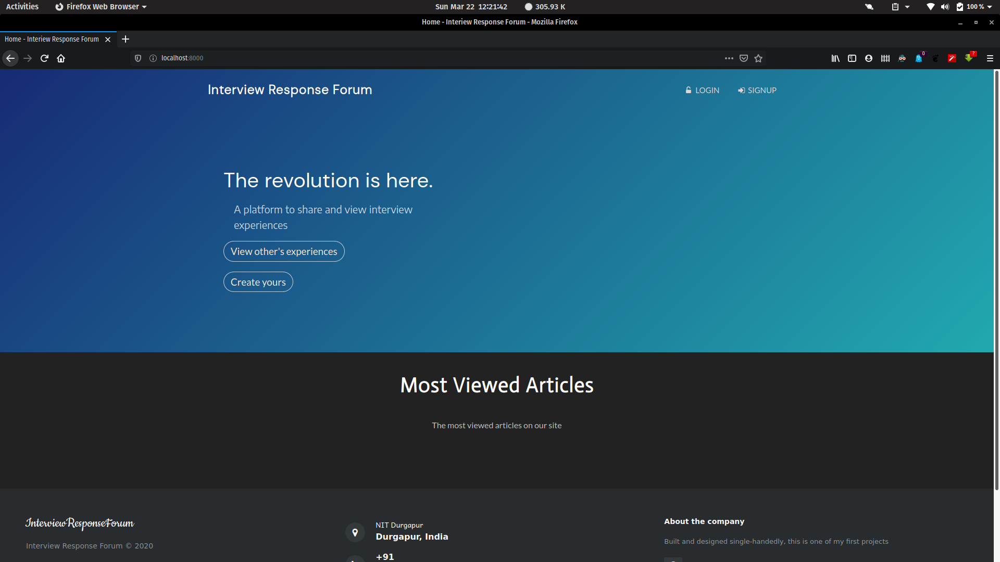

<h1>Interview Response Forum</h1>
An app to share interview reviews

<h2>Built With</h2>
1.Python 
2.Django

<h2>Getting started</h2>
<h4>Prerequisites</h4>

1. Python
2. Pip

<h3>Installation</h3>
<code>
mkdir project

cd project

virtualenv .

source bin/activate

git clone https://github.com/kumanik5661/InterviewResponseForum.git

cd InterviewResponseForum

pip install -r requirements.txt

python manage.py makemigrations

python manage.py migrate

python manage.py runserver
</code>
<h2>Home Page screenshot</h2>

